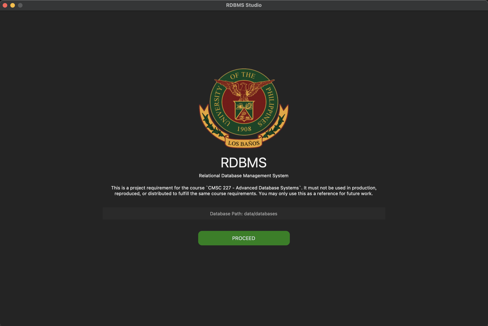

# RDBMS

This **Basic Relational Database Management System** is designed for managing, retrieving, and storing data. It currently permits only three operations: `INSERT`, `SELECT`, and `DELETE`. While most query clauses are not allowed, the `WHERE` clause is an exception; it can include up to two conditions, which may be combined using `AND` or `OR`.

Please be aware that this is a project requirement for the course `CMSC 227 - Advanced Database Systems`. It must not be used in production, reproduced, or distributed to fulfill the same course requirements. You may only use this as a reference for future work.



## Requirements
- Python v3.10.15
- antlr4-python3-runtime
- python-dotenv
- python3-venv
- CTkTable
- Pillow
- CustomTkinter
- CairoSVG
- pandas
- pyinstaller

## Installation (MacOS)
**A.** Install Python using Homebrew
```cli
brew install python@3.10.15
brew install python3-venv
```

> IMPORTANT: Please make sure to install the exact version of Python to prevent threading issues.

**B.** Create a Python virtual environment inside the project directory
```python
python3 -m venv venv
```

**C.** Activate virtual environment
```cli
source venv/bin/activate
```

**D.** Install other requirements
```python
python -m pip install -r requirements.txt
```
**E.** Locate the database configuration file in the `configs/` directory and rename `.env.example` to `.env`.  

**F.** Run the RDBMS Studio
```python
python src/studio/main.py
```
## Distribution
This application uses pyinstaller to create a distributable MacOS package quickly and easily. To build from source, follow the steps below   

**A.** Set the `datas` configuration in the `main.spec` file
>     datas=[('configs/.env', 'configs'), ('data', 'data'), ('data/databases/', 'data/databases'), ('src/engine', 'engine'), ('src/compiler', 'compiler'), ('src/schemas', 'schemas'), ('src/scripts', 'scripts'), ('src/studio/ui', 'ui'), ('src/studio/assets', 'assets')]   

**B.** Add the following packages to the `hiddenimports`
> hiddenimports=[('os'), ('antlr4'), ('pandas')]   

**C.** Use `.icns` format for the application's icon   
> icon='src/studio/assets/imgs/icon.icns'

**D.** Generate executable file
>  pyinstaller main.spec

## Security
Unsigned macOS applications will not work on other machines. To run the application on a different machine, you need to remove the quarantine attribute of the package by running the xattr command.

> xattr -dr com.apple.quarantine /Users/`your-username`/Downloads/`your-app-filename`

## Documentations


* [Project Components ](./docs/components.md)
* [Database](./docs/database.md)
* [Supported SQL Commands](./docs/commands.md)