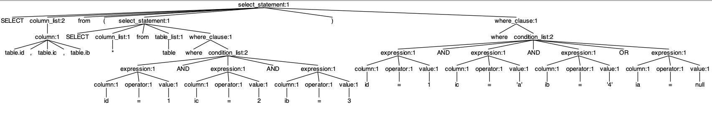
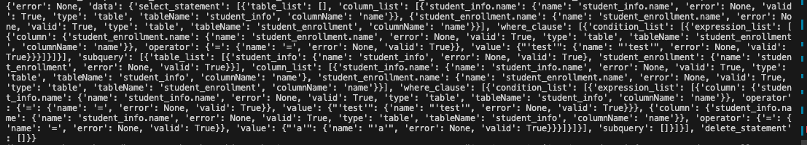

## Parser (Antlr4)

### Building from Source
```bash
  antlr4 -Dlanguage=Python3 ./src/parser/SQL.g4
```

### Inspecting Parse Tree
```bash
  antlr4-parse ./src/parser/SQL.g4 sql_statement  -gui ./src/parser/tests/sql_samples/select.txt
```

### Test Parser
```python
  python src/parser/tests/parser.py
```


## Annotator

### Test Annotation
```python
  python src/parser/tests/annotator.py "SELECT * FROM (SELECT student_info.name, student_enrollment.name FROM student_info, student_enrollment WHERE student_info.name='test' OR student_info.name='a') WHERE student_enrollment.name = 'test';"
```

